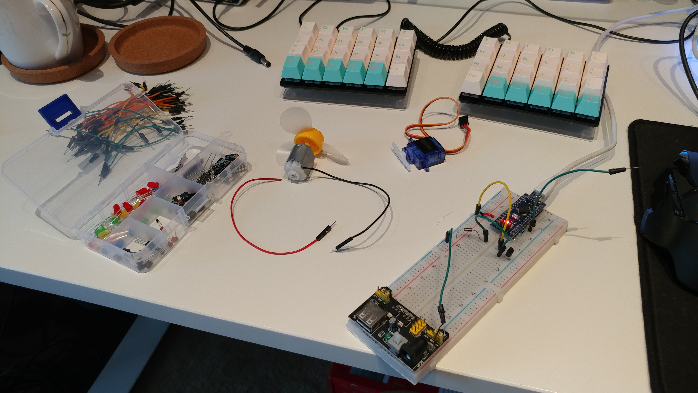

## Hello World
This is my first ever blog post 😉. Am I doing this right? I don't expect anyone to ever read this (unless I become super famous or something) but this is just something to keep me more accountable for my day to day and to also practice with some writing skills. Oh wait, I guess I didn't ever introduce myself... I'm Andy Bae, a mechanical engineering masters student at Duke University (still feels weird mentioning that as if it's some sort of brag but also because I don't really feel like I should be there.. I mean look at these terrible writing skills).

## What I want out of the blog
As mentioned, I want to just have some kind of writing practice that I can do everyday and this is a good place for me to also be accountable for non-gamedev related things that I don't really feel fits my Twitter. Basically this is a public diary that I'd be embarassed if someone actually read... Sounds like a great idea 😅

# Test1
## Test 2
### Test 3
#### Test 4

# Actual day

## F the rain
me no likey rain

## Arduino
Tried to put my Arduino skills to the test and epically failed... OMG why can't I get this stupid DC motor working. Was struggling for hours and in the end I just broke off the wire to it. I could've just soldered it back on but man is it frustrating when something that you think would take you 30 minutes ends up taking 2+ hours 😡. Made me late to my appointment to pick up my lab keys but I guess that's something I'll just do tomorrow. Tomorrow's looking really busy... hope I don't die.