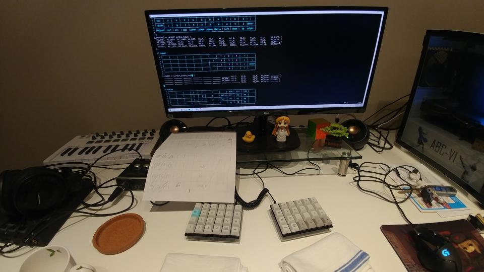
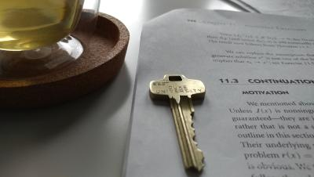

## Splitting up with my keyboard (hacker time 😎)
Long ago I was hyped. Hyped for keyboards with the sexy force graphs and those oooh so glorius tactile bumps. But one day, I hyped for this really dumb looking keyboard, and after a long wait and then finally using it for a second, found it to be pretty meh. And since then, my passion for keyboards died out... UNTIL TODAY! Inexplicably I pulled out my dumb keyboard and tried it out again and then found it meh again... But I pulled it out a second time that same day and boy... what a wild ride. I haven't found typing to be such a joy since my first mechanical keyboard. There's quite a learning curve to the way of the let's split (wpm went down from 75 to 30 and then to 55) but that just makes it so much more fun. I still can't get over that I can delete my mistakes with my right thumb. I think that was the key to making this the perfect typing experience for me; getting my right thumb into the action. I also have it set up so that a modifier key changes the right hand side into a numpad so now I don't even need a numpad anymore and my left side has easily accessible braces of all kinds ()(){}{}()](){}{}()()[][]]() wowowowow very fun. My only complaint is that the p key is a real pain to hit with my pinky and so I usually have to do a awkward stretch with my ring finger which is only amplified now that the key is further away. That and when I type .com I keep hitting the i key for some reason =_=. Overall really happy with this switch and I'm getting a bunch of new switches and accessories for my new daily driver... and so the saga continues...

## Finally a place to call home 😊
Got my keys to the lab yesterday yayayay. Kind of a weird thing to be happy about but it feels more solid that I'm part of a research team at a top university... Still feels weird being part of a research group again. Feel kind of out of place with all these really talented programmers but I hope I can make my programming skills shine as well once I figure out more of C++ 😅.

## More meta conversation about the blog
Was searching up a bit on how I could get the most out of my blog for my purposes but dang there were a lot of stuff on just people trying to monetize on it. Can we not? All this talk about money almost sucks the joy out of it, like if you aren't making any money then why bother. Can I not just shout into my void? But then, when I asked myself that, I couldn't help but wonder why the heck I'm making all this public in the first place. I could easily just keep this all to myself as a personal journal. But I guess there's less accountability of action when you do that? Does that really matter if you're writing to a place you know people won't find? I don't know man that's weird. Wait... how the heck did you end up here?